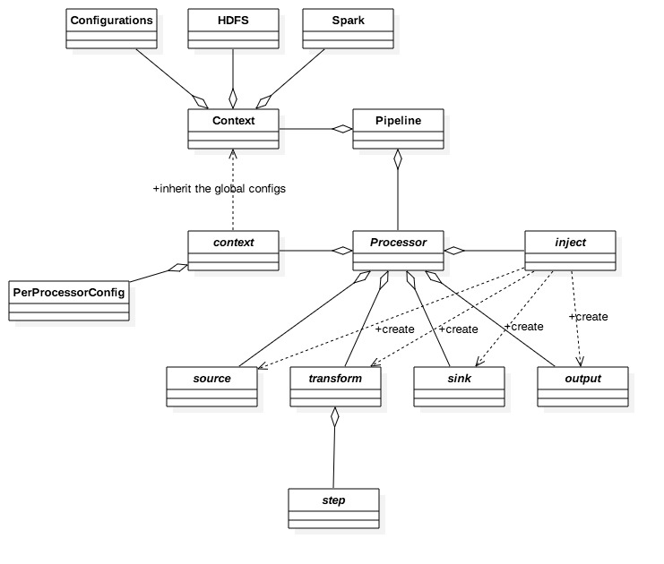
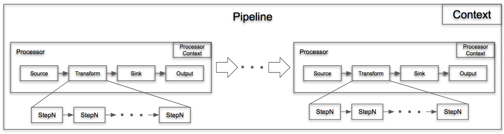

## Abstractions

The Kids-First ETL (ETL for short) consists of a set of consecutive data transformations. Transformations are grouped into logical units which are modelled as `Processors`. Processors join together to form a `Pipeline`, which is the top level abstraction of the ETL. The `Pipleline` manages `Processors` and global resources through `Context`. 

Each `Processor` manages subordinate but important abstractions for the purpose of separation of concerns. These abstractions serve as `functions` taking  specific inputs and returning as an output the results of transformation. 
* `source`: defines how to load the processor-specific data
* `transform`: defines how to make the processor-specific data transformations
* `sink`: defines whether and how to write the transformed data to the external storage
* `ouput`: defines how to pass the transformed data to the next processor in the `Pipeline`
* `context`: maintains the processor-scoped resources for the execution of the current `Processor`
* `step`: defines the smallest transformation unit executed in a finer-grained way
* `inject`: creates the instances of the above abstractions in a non-invasive way

We can visualize all of these parts as a Class diagram: 


Most of the processors have been defined as Scala [Function1[-T1, +R]](http://www.scala-lang.org/api/2.11.12/#scala.Function1)

## Functional programming in Scala

Scala is both a Functional and Object-Oriented programming language. In Scala, functions are *first-class* language constructs and are part of the type system. Functions can be:
* Assigned to variables
* Passed as parameters to functions, constructors, etc
* Returned as results of functions
* Written as function literals. 

In functional programming, a function is required to be *pure*, which means forbidding changing-state and mutable data. If the execution of a function depends on not only the inputs, but also the context, the function probably has some hidden internal behaviors which means side effects and impurity.

For the ETL pricess, we have used several of the Scala functional features. 

### Immutability

Scala encourages developers to define immutable data structures and variables. Immutability helps keep control of the application states, avoid unexpected values, and avoid concurrent state issues. Collection types defined in the package `scala.collection.immutable` are immutable. Some functions in those types return a new instance of the same type instead of altering the collection in-place. This feature makes the method chaining possible. For example:
```
List("Jan", "Feb", "Mar", ..)
    .filter(m => {???})
    .map(m => {???})
    .collect(m => {???})
```

Another interesting and  powerful language construct is `case classes` as the following definition:
```
case class Address(number:Int, street:String, city:String, province:String)
```
Scala compiler will add some syntactic conveniences to the class:
* A factory method with the name of the class. This means that, for example, you can write `Address(661, "University Ave", "Toronto", "ON")` to construct a Address object. Under the hood, the `apply(...)` method generated in the companion object makes this magic possible.
* All arguments in the parameter list of a case class implicitly get a `val` prefix
* The "natural" implementations of methods `toString`, `hashCode`, and `equals`
* A `copy` method, which is useful for making a new instance of the class that is the same as another one except that one or two attributes are different. For example:
```
val addr = Address(661, "University Ave", "Toronto", "ON")
val new_addr = addr.copy(province = "Ontario")
```

### Higher-order functions

In Scala, a function can be defined in the standard way:
```def plusOne(x:Int):Int = {x + 1}```
or as a functional literal:
```val func = (x:Int) => x + 1```

Basicaly, a higher-order function can have one the three forms:
* one or more of its parameters is a function, and it returns some value
* it returns a function, but none of its parameters are a function
* both of the above

Functions like `map`, `filter` or `flatMap` defined in collection types are the first type. In the section [Implementation Details]() we will examine how the ETL uses the other two types, especially function composition to make function chaining possible.

### Pattern Matching

Pattern Matching in Scala is amazingly powerful. Here are some examples:
* wildcard, varable, constructor patterns:
```
expr match {
    case Address(number, street, _, _) => println(s"${number}, ${street}")
    ...
}
```
* constant patterns:
```
expr match {
    case 10 => "ten"
    case false => "false"
    case "hello" => "hi!"
    case Nil => "the empty list"
    case _ => "something else"
}
```
* sequence patterns:
```
list match {
    case List(0, _, _) => println("the list starts with 0")
    case _ => 
}
```
* typed patterns
```
expr match {
    case s: String => s.length
    case m: Map[_, _] => m.size
    case _ => -1
}
```
* variable binding:
```
case class Company(addr: Address, contact:String)

company match {
    case Company(oicr @ Address(661, "University Ave", "Toronto", "ON"), _) => println(oicr)
    case _ =>
}
```

Under the hood, the `apply(...)` function plays very important role in pattern matching.

### Handling errors without exceptions

The Scala way to handle exceptions is to represent failtures and exceptions with ordinary values, and the developers can write higher-order functions that abstract out common patterns of error handling and recovery.

The `Try` class is defined for this purpose. A `Try[T]` represents a computation that may result in a value of type `T`. If the computation is successful, a `Success[T]` is returned. Or a `Failture[T]` is returned. We can make use of the pattern matching as the following:
```
val computation = Try(....)
computation match {
    case Success(ret) => { logic for successful operation }
    case Failture(failed) => { error handling } 
}

```

## Implementation Details

This section explains how the ETL applies Scala's functional features.



### Data Models

The ETL uses [ScalaPB](https://scalapb.github.io/), a Scala implementation of Google [Protocol Buffers](https://developers.google.com/protocol-buffers/), as the representation of the internal data model. [Protocol Buffers](https://developers.google.com/protocol-buffers/) are  language-neutral, platform-neutral extensible mechanisms for serializing structured data. It ensures that all exchanged data follows predefined formats and increases  data consistency.

ScalaPB is built on top of the Protocol Buffer compiler and has many advantages that the ETL values including:
* Supports both proto2 and proto3. The ETL uses `proto2` because some fields of the source data are optional and only `proto2` supports the keywords `optional` and `required`. 
* Supports SparkSQL
* Supports converting to and from JSON. The ETL uses this to directly generate JSON strings.
* Supports generating case classes for all messages. Applying case classes to Spark Dataset is intuitive, so that no extra [Encoder](http://spark.apache.org/docs/latest/api/scala/index.html#org.apache.spark.sql.Encoder)s are needed.
* Supports introspection of generated case classes 

### Context

`Context` holds globally shared resources like `SparkSession`, `PostgresQL`, and `Elasticsearch` and is defined like this:

```
object Context extends ContextTrait with ClasspathURLEnabler{
  lazy val (hdfs, rootPath) = getHDFS()
  lazy val sparkSession = getSparkSession()
  lazy val postgresql = getPostgresql()
  lazy val esClient = getESClient()
  
  ...
}
```

### Processor

`Processor` is the key abstraction in the ETL and is defined like this:
```
trait Processor[I, O] extends Function1[I, O]{
  override def apply(input: I): O = {
    process(input)
  }
  def process(input:I): O
}
```

The `Processor` is derived from Scala's [Function1[-T1, +R]](http://www.scala-lang.org/api/2.11.12/#scala.Function1) which basically means that a `Processor` is just a function. Any concrete `Processor` fills its logic by overriding the function `process(input:I):O`. Technically, a `Processor` could be implemented in any direct or indirect way. However, the reference implementations follow this convention:

> A Processor is composed of source, transform, sink and output. A transform can be composed of Steps. The ProcessorContext and  StepContext hold shared resources for a Processor and a Step respectively.

`Source`, `transform`, `sink` and `output` are types, but the ETL doesn't define the particular base interface respectively. Instead, they are all derived from Scala [Function1[-T1, +R]](http://www.scala-lang.org/api/2.11.12/#scala.Function1). This means that a `Processor` can be implemented in a very consistent and simple way like this:

```
class FileCentricProcessor(context: FileCentricContext,
                           source: Repository => DatasetsFromDBTables,
                           transform: DatasetsFromDBTables => Dataset[FileCentric],
                           sink: Dataset[FileCentric] => Unit,
                           output: Unit => (String,Repository)) extends Processor[Repository, (String,Repository)]{

  override def process(input: Repository):(String,Repository) = {
    source.andThen(transform).andThen(sink).andThen(output)(input)
  }

}
``` 

The key point is the usage of the `andThen` function defined in Scala [Function1[-T1, +R]](http://www.scala-lang.org/api/2.11.12/#scala.Function1). `andThen` allows  function calls to be changed together sequentially rather than nested together. 

#### `inject` in Processor

Another convention in `Processor` is:

> Every Processor provides a dependency injection module backed by Google Guice. At runtime, the Pipeline will load all of the inject module instances annotated with @GuiceModule(name = "...") and instantiate the corresponding components 

An inject module has its base class defined as the following:
```
abstract class ProcessorInjectModule(val sparkSession: SparkSession,
                                     val hdfs: HDFS,
                                     val appRootPath: String,
                                     val config: Option[Config]) extends AbstractModule{
  type CONTEXT
  type PROCESSOR
  type SOURCE
  type SINK
  type TRANSFORMER
  type OUTPUT

  def getContext(): CONTEXT
  def getProcessor(): PROCESSOR

  def getSource(context: CONTEXT): SOURCE
  def getSink(context: CONTEXT): SINK
  def getTransformer(context: CONTEXT): TRANSFORMER
  def getOutput(context: CONTEXT): OUTPUT

}
```

An implementation module should provide the concrete type definitions for all the `type ***` declarations. For example:

```
@GuiceModule(name = "download")
class DownloadInjectModule(sparkSession: SparkSession,
                           hdfs: HDFS,
                           appRootPath: String,
                           config: Option[Config]) extends ProcessorInjectModule(sparkSession, hdfs, appRootPath, config) {
  type CONTEXT = DownloadContext
  type PROCESSOR = DownloadProcessor
  type SOURCE = DownloadSource
  type SINK = DownloadSink
  type TRANSFORMER = DownloadTransformer
  type OUTPUT = DownloadOutput
  
  ...
}
```


#### `transform` and `step` in Processor

As you can guess,  `Step` is also a Scala [Function1[-T1, +R]](http://www.scala-lang.org/api/2.11.12/#scala.Function1).  It is the smallest executable unit in the ETL and performs a very specific data transformation logic.

```
case class Step[I, O](val description: String, val handler: StepExecutable[I, O], val posthandler: StepExecutable[O, O] = DefaultPostHandler[O]()) extends Function1[I, O] {
  override def apply(input: I): O = {
    handler.andThen(posthandler)(input)
  }
}

abstract class StepExecutable[-I, +O] extends Function1[I, O] with Serializable {
  override def apply(v1: I): O = {
    process(v1)
  }

  def process(input: I):O
  def ctx():StepContext
}
``` 

`Step` itself is a case class composed of a description, a handler, and a posthandler. `Step`'s behavior is defined through `StepExecutable`, which is a Scala [Function1[-T1, +R]](http://www.scala-lang.org/api/2.11.12/#scala.Function1) of course.

Let's take a look at how to chain `Step`s together:

```
class FileCentricTransformer(val context: FileCentricContext) {

  def transform(input: DatasetsFromDBTables): Dataset[FileCentric] = {

    ... ...
    
    Function.chain(
      Seq(
        Step[Dataset[Participant], Dataset[Participant]]("01. merge Study into Participant", new MergeStudy(ctx), posthandler1("step1")),
        Step[Dataset[Participant], Dataset[Participant]]("02. merge Demographic into Participant", new MergeDemographic(ctx), posthandler1("step2")),
        Step[Dataset[Participant], Dataset[Participant]]("03. merge Diagnosis into Participant", new MergeDiagnosis(ctx), posthandler1("step3")),
        Step[Dataset[Participant], Dataset[Participant]]("04. compute HPO reference data and then merge Phenotype into Participant", new MergePhenotype(ctx), posthandler1("step4")),
        Step[Dataset[Participant], Dataset[Participant]]("05. merge 'availableDataTypes' into Participant", new MergeAvailableDataTypesForParticipant(ctx), posthandler1("step5")),
        Step[Dataset[Participant], Dataset[Participant]]("06. merge family member into Participant", new MergeFamilyMember(ctx), posthandler1("step6"))
      )
    ).andThen(
      {
        val ph = (filename:String) => new WriteKfModelToJsonFile[GfId_Participants](ctx)
        Step[Dataset[Participant], Dataset[GfId_Participants]]("07. merge Sample, Aliquot into Participant", new MergeSampleAliquot(ctx), ph("step7"))
      }
    ).andThen(
      Step[Dataset[GfId_Participants], Dataset[FileCentric]]("08. build final FileCentric", new BuildFileCentricNew(ctx), posthandler2)
    )(context.sparkSession.emptyDataset[Participant])

  }

}

``` 

This time, we don't use the `andThen` function only but instead we compose the pipeline from the `Function.chain` function. The difference is that `Function.chain` accepts a sequence of [Function1[-T1, +R]](http://www.scala-lang.org/api/2.11.12/#scala.Function1) calls which have the same input and output types. `andThen` is used to chain functions with different input and output types.

### Pipeline

A `Pipeline` defines the workflow and is responsible for creating `Processor`s through their `inject`s. 

## Summary

The Kids-First ETL is an attempt to combine both FP and OOP paradigms to build  large-scale, data-intensive, and distributed applications. Although it only uses a small set of Scala's functional features, the FP helps simplify the design and implementation and provides a beneficial supplement to OOP.  

## Next Steps

There are some potential enhancements we could do in the future.

* `FileCentricProcessor` and `ParticipantCentricProcessor` share some common `Step`s. These `Step`s could be upgraded into a common Processor.
* Currently, the execution order of Processors is hard-coded in the `Pipeline`. A nice future enhacement would be to  make the `Pipeline` programmable by defining operators within `Pipeline` that accept Processor(s) as input and determine how to execute the Processor(s).

## References

[Functional Programming in Scala](https://www.manning.com/books/functional-programming-in-scala)

[Programming in Scala](https://www.artima.com/pins1ed/)

[The Neophyte's Guide to Scala](http://danielwestheide.com/scala/neophytes.html)